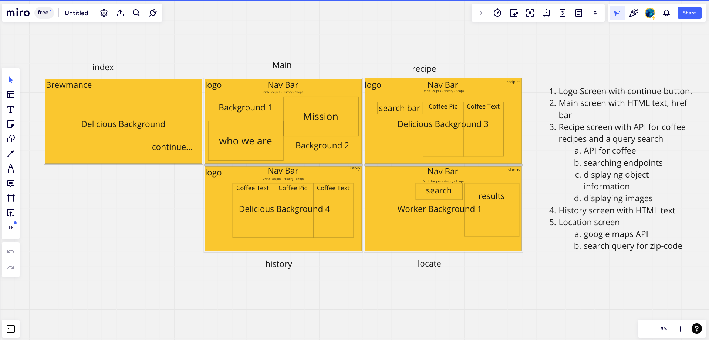

# What is Brewmance?

- Brewmance is a mixture of node, template, and html to create a recipe web application with coffee as the star ingredient. Whether you love coffee or want to begin a new journey, the API call from Spoonacular will dynamically display recipes to cycle through. Information about coffee can be found with a Google Map API as well.

# Why Brewmance?

- My mom loves coffee. I do not. But I do bake and the recipes found within have a lot of creative and tasty dishes that are easy to make.

- I also wanted to take on the task of writing code outside of a framework like React. Practicing my template and back-end skills.

## This is how I get started with apps and web pages.

# Struggles

1. Src'ing external javascript in HTML when using Node.

   - Because I decided to use a template engine, mustache, my client side does not have access to my server side.

2. Node ENV

   - I was unable to use process.env for my API keys because of the above issue. Causing me to have to inlucde the key in the script tags, and remove each time I commited to github.

3. Cycling through the data on a button click

   - With my API call in the HTML script, each time the page is loaded the API would fire. I needed to create a button that would call the API when desired. The data would display all information in one place and the option to scroll through the entire cookbook didn't seem practical.

4. Dispalying images one at a time with corresponding info

   - Originally I had included a setInterval method to cycle through the objects and pull out the needed information. The fade in/out method didn't seem practical.

   I then needed to create a way to dynamically display the information from each object on a button click. This had to be done outside the scope of the API but still have access to the values. I was able to learn how to write a code that would cycle the classnames of the object data and display one at a time.

# Overall

- About half way through this project I learned that I was going to have to massivley scale back my original plans due to the **limitations of template engines**. There were many times I almost scrapped the project entirely.

- I plan to take all of this code and implement it into React with more functionality. Please stay tuned to Bremance v 2.0 in React

[You can use this link to get back to my portfolio] (http://dave2dev.com/).
